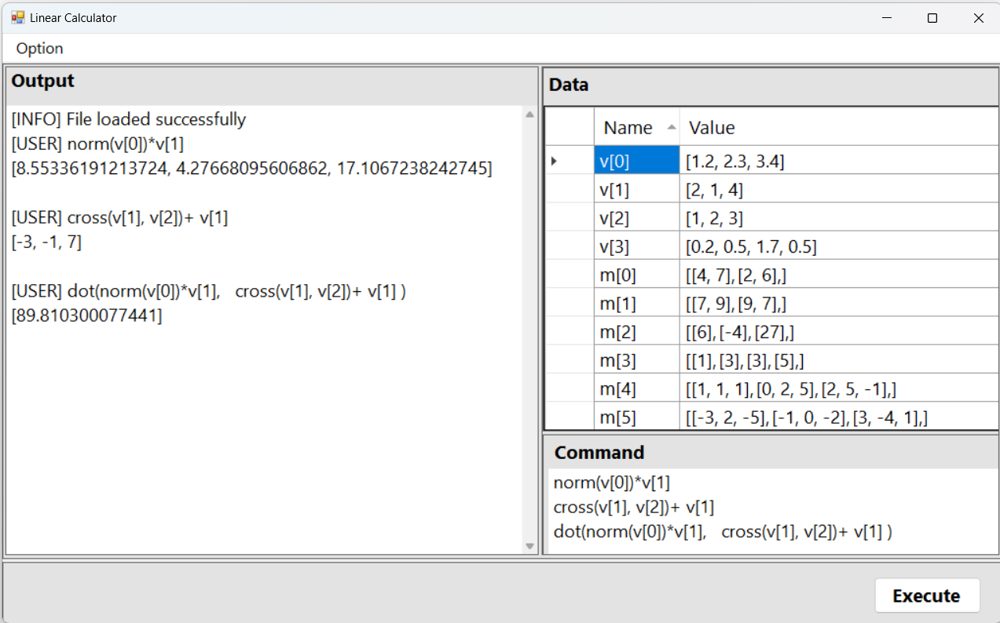

# Vector & Matrix calculator



## Input Format

**Vector**
```cpp
// V {dimention} {value}
V 3 1 2 3
```
$$
v=\begin{bmatrix} 1 \\ 2 \\ 3 \end{bmatrix}
$$

**Matrix**
```cpp
// M {rows} {cols} {value}
M 3 2 0 1 2 3 4 5 // row=3, col=2
```
$$
m=
\begin{bmatrix}
0 & 1 \\
2 & 3 \\
4 & 5 \\
\end{bmatrix}
$$
## Vector Functions

The following functionalities have been implemented in the vector functions:

|Function|Description|Input|Output|
|-|-|-|-|
|`dot(a, b)`|[Compute the dot product of two vectors.](https://en.wikipedia.org/wiki/Dot_product)|$\vec{a}, \vec{b} \in \mathbb{R}^n$| $\vec{v} \in \mathbb{R}^n$|
|`norm(a)`|Calculate the norm (magnitude) of a vector.|$\vec{a} \in \mathbb{R}^n$| $\vec{v} \in \mathbb{R}^1$|
|`normal(a)`|Normalize a vector to a unit vector.|$\vec{a} \in \mathbb{R}^n$| $\vec{v} \in \mathbb{R}^n$|
|`cross(a, b)`|Compute the cross product of two 3D vectors.|$\vec{a}, \vec{b} \in \mathbb{R}^3$| $\vec{v} \in \mathbb{R}^3$|
|`com(a, b)`|Find the component of vector a along vector b.|$\vec{a}, \vec{b} \in \mathbb{R}^n$| $\vec{v} \in \mathbb{R}^1$|
|`proj(a, b)`|Compute the projection of vector a onto vector b.|$\vec{a}, \vec{b} \in \mathbb{R}^n$| $\vec{v} \in \mathbb{R}^n$|
|`Area(a, b)`|Calculate the area of the triangle formed by vectors a and b.|$\vec{a}, \vec{b} \in \mathbb{R}^n, n\in\{2,3\}$| $\vec{v} \in \mathbb{R}^1$|
|`angle(a, b)`|Determine the angle (in radians) between two vectors.|$\vec{a}, \vec{b} \in \mathbb{R}^n$| $\vec{v} \in \mathbb{R}^1$|
|`pn(a, b)`|Compute the normal vector of the plane formed by two 3D vectors.|$\vec{a}, \vec{b} \in \mathbb{R}^3$| $\vec{v} \in \mathbb{R}^3$|
|`ob(a, b, c ...)`|Use Gram-Schmidt process to find orthonormal basis from multiple vectors.|$\vec{a}, \vec{b}, \vec{c}, \ldots  \in \mathbb{R}^n$| Vector array|

## Vector judgement
+ Not for operation

|Function|Description|Input| Output |
|-|-| -| -|
|`isparallel(a,b)`|Parallel judgement.| $\vec{a}, \vec{b} \in \mathbb{R}^n$|String `Yes` or `No`|
|`isorthogonal(a,b)`|Orthogonal judgement.|$\vec{a}, \vec{b} \in \mathbb{R}^n$|String `Yes` or `No`|
|`isli(a, b)`|Linear independent judgement|$\vec{a}, \vec{b} \in \mathbb{R}^n$|String `Yes` or `No`|

## Vector Operator
The table below outlines the vector operators and their respective descriptions, input, and output:

| Operator | Description | Input | Output |
|---|---|---|---|
| + | Vector Addition | $\vec{a}, \vec{b} \in \mathbb{R}^n$ | $\vec{v} \in \mathbb{R}^n$ |
| - | Vector Subtraction | $\vec{a}, \vec{b} \in \mathbb{R}^n$ | $\vec{v} \in \mathbb{R}^n$ |
| * | [Vector Element-wise Product](https://en.wikipedia.org/wiki/Hadamard_product_(matrices)) | $\vec{a}, \vec{b} \in \mathbb{R}^n$ | $\vec{v} \in \mathbb{R}^n$ |

# Matrix
### printM
```
printM ($m[0])
```
### calM() 
* Matrix addition & subtraction(2%)
* Matrix Multiplication(2%)
```
calM $m[0]+$m[1]
```
### Rank(m) 
* Rank of Matrix(5%)
### Trans(m)
Matrix Transpose(2%)
###  Sol (a,b)
Solve Linear System(5%)
```
Sol ($m[0],$m[1])
```
### det(m)
Determinants of Matrix(3%)
### Inverse(m)
Inverse Matrix(6%)
```
Inverse ($m[0])
```
### Adj(m)
Adjoint of Matrix(3%)
```
Adj ($m[0])
```
### eigen(a)
Eigen Vector and Eigen Value(10%)
```
eigen ($m[0])
eigen ($m[1])
eigen ($m[2])
```
### PM(m)
Power Method of Eigen value(6%)
```
PM ($m[0])
```
### LeastSquare(m1,m2)
Method of Least Square(6%)
```
LeastSquare ($m[0],$m[1])
LeastSquare ($m[2],$m[3])
LeastSquare ($m[4],$m[5])
LeastSquare ($m[6],$m[7])
```
### rref(M)
```
rref ($m[0])
```

